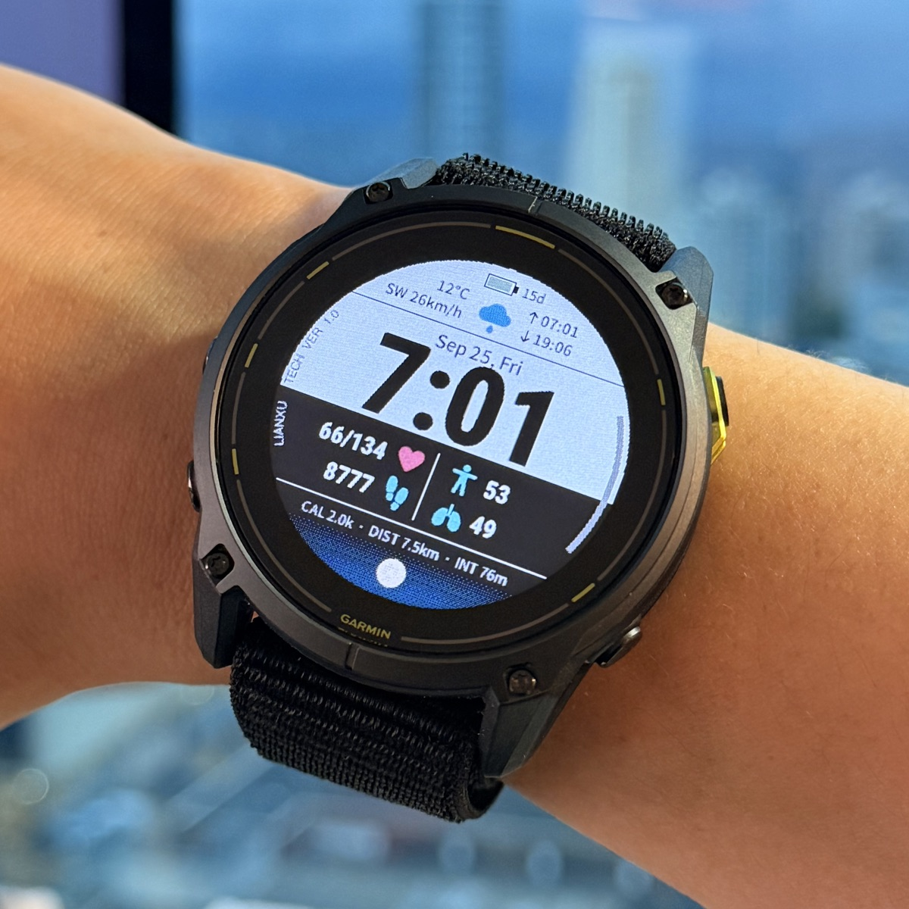

# Liam

Garmin Connect IQ Watch Face for the Enduro 3, built with Monkey C.

Designed by Xu Lian.

<p align="center">
  
</p>

## Prerequisites

- macOS
- [Visual Studio Code](https://code.visualstudio.com/)
- Oracle Java Runtime Environment 11 or newer
- [Connect IQ SDK Manager](https://developer.garmin.com/connect-iq/sdk/)
- Garmin's **Monkey C** extension for VS Code
- A Garmin Connect account for SDK Manager

## Set Up the Toolchain

1. Download the Connect IQ SDK Manager, open its disk image, and copy the app to a permanent folder such as `/Applications`.
2. Launch SDK Manager, sign in, install a current Connect IQ SDK, and download the device definitions for the watches you intend to support.
3. In VS Code, install the **Monkey C** extension published by Garmin.
4. Open the Command Palette with `Cmd+Shift+P` and run **Monkey C: Verify Installation**.
5. Run **Monkey C: Generate a Developer Key** and save the key outside this repository. Back it up securely: the same key is required to publish updates to an existing Connect IQ Store app.
6. If needed, set the key location under **Settings > Monkey C: Developer Key Path**.

The compiler requires an RSA 4096-bit private developer key. Never commit that key to source control.

## Create the Initial App

Use `Cmd+Shift+P` and run **Monkey C: New Project**. Choose the app type that matches the intended product:

- **Watch App** for an interactive application
- **Watch Face** for the normal watch display
- **Data Field** for an activity data page
- **Widget** or **Glance** for glanceable information, where supported

Select the minimum API level based on the oldest device you need to support, not simply the newest installed SDK. Once generated, the project should contain:

```text
manifest.xml        App metadata, type, API level, and supported products
monkey.jungle       Build configuration
source/             Monkey C source files
resources/          Strings, layouts, drawables, fonts, and other resources
bin/                Generated build output
```

Then run **Monkey C: Edit Products** and select the specific Garmin products to support. Keeping this list intentional makes simulator testing and compatibility work manageable.

## Build Quickly

Run the build-only script from the repository root:

```zsh
./build.sh
```

It auto-detects the newest installed Connect IQ SDK, compiles for Enduro 3, signs the program, writes `bin/Liam.prg`, and exits. It does not launch or attach to the simulator.

Pass another installed product ID as the first argument:

```zsh
./build.sh fenix8solar51mm
```

Build a release artifact with stripped debug information and fast optimizations:

```zsh
./build.sh enduro3 release
```

Optional environment overrides are `CONNECTIQ_SDK_HOME`, `CONNECTIQ_DEVELOPER_KEY`, `TARGET_DEVICE`, `BUILD_MODE`, and `OUTPUT_FILE`.

## Run in the Simulator

1. Open a `.mc` file under `source/`.
2. Press `Cmd+F5` or choose **Run > Run Without Debugging**.
3. Select a supported product when prompted.
4. Test rendering, input, lifecycle transitions, and settings in the Connect IQ simulator.

The simulator and `monkeydo` are long-running by design. Use `./build.sh` when you only need a quick compile that returns to the shell.

To test on a physical watch, connect it over USB, run **Monkey C: Build for Device**, select the matching product, and copy the generated `.prg` file to the watch's `GARMIN/APPS` directory.

## Deploy to a Physical Watch

Connect and unlock the watch in MTP mode, quit Garmin Express, then run:

```zsh
./deploy.sh
```

The script installs Homebrew `libmtp` when needed, builds the Enduro 3 program, finds the watch's `GARMIN/Apps` folder, removes an existing `Liam.prg`, and uploads the new build. Disconnect the watch from USB after deployment so Garmin can load the app.

Pass another installed product ID as the first argument:

```zsh
./deploy.sh fenix8solar51mm
```

Build and deploy in release mode:

```zsh
./deploy.sh enduro3 release
```

Set `AUTO_INSTALL_LIBMTP=0` to prevent automatic package installation. If the watch exposes a different folder path, set `MTP_APPS_PATH` to the path reported by `mtp-folders`:

```zsh
AUTO_INSTALL_LIBMTP=0 MTP_APPS_PATH="/GARMIN/Apps" ./deploy.sh
```

## Optional Command-Line Workflow

The SDK's `bin` directory contains `monkeyc` (compiler) and `monkeydo` (simulator launcher). Add that directory to `PATH`, and keep the signing-key path in a local environment variable rather than in repository files:

```zsh
export PATH="/path/to/connectiq-sdk/bin:$PATH"
export CONNECTIQ_DEVELOPER_KEY="$HOME/.config/garmin/developer_key.der"
```

After the project is generated, the VS Code extension remains the simplest source of correct device-specific build commands. Run `monkeyc --help` and `monkeydo --help` for the CLI options supplied by the installed SDK.

## References

- [Connect IQ Getting Started](https://developer.garmin.com/connect-iq/connect-iq-basics/getting-started/)
- [Your First Connect IQ App](https://developer.garmin.com/connect-iq/connect-iq-basics/your-first-app/)
- [Monkey C API Reference](https://developer.garmin.com/connect-iq/api-docs/)
- [Compatible Devices](https://developer.garmin.com/connect-iq/compatible-devices/)